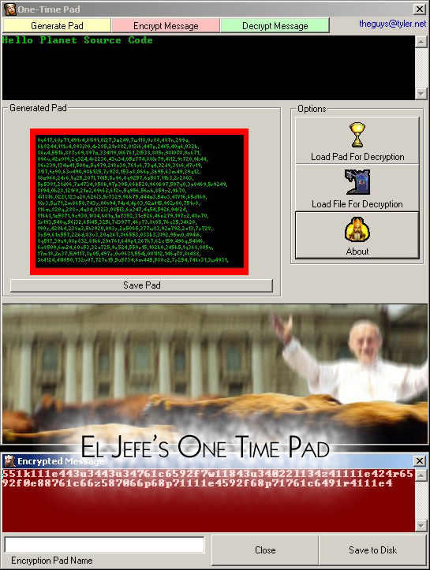



## One\-Time Encryption Pad

### Description

The program generates a 'pad' of 200 (10x20) keys. Each key has a random length, is consisted of random numbers, a random letter, and the letter is placed randomly in the key. The message is encrypted using this 'pad', making it virtually undecryptable without the pad

NOTE: I plan to have 2 different keys for each letter, but that will come later.
 
### More Info
 
Your message. The Pad is generated randomly, though you can open a saved pad.

The program is a good example of random numbers, arrays, and loops. Beware, the coding can get confusing to the intermediate or beginner user

An encrypted (or decrypted) message.

Once you lose the pad, the message is not recoverable (unless you have a key sniffer installed, or you remember it)

             |
---                |---
**Submitted On**   |2003-03-08 20:25:34
**By**             |[Daniel \(a\.k\.a\. El Jefe OR Where is El Jefe\)](https://github.com/Planet-Source-Code/PSCIndex/blob/master/ByAuthor/daniel-a-k-a-el-jefe-or-where-is-el-jefe.md)
**Level**          |Advanced
**User Rating**    |3.0 (9 globes from 3 users)
**Compatibility**  |VB 6\.0
**Category**       |[Encryption](https://github.com/Planet-Source-Code/PSCIndex/blob/master/ByCategory/encryption__1-48.md)
**World**          |[Visual Basic](https://github.com/Planet-Source-Code/PSCIndex/blob/master/ByWorld/visual-basic.md)
**Archive File**   |[One\-Time\_E155678382003\.zip](https://github.com/Planet-Source-Code/daniel-a-k-a-el-jefe-or-where-is-el-jefe-one-time-encryption-pad__1-43867/archive/master.zip)

